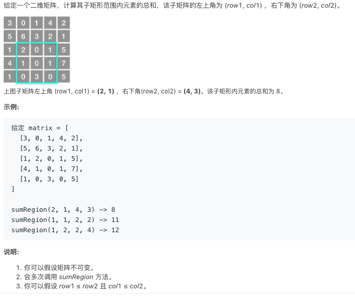
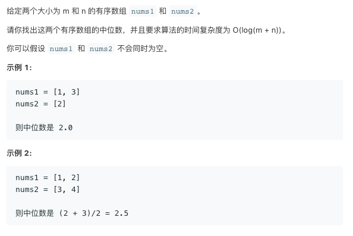
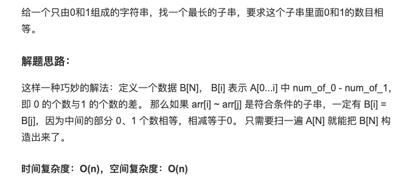

[TOC]


#### 1. 题目：一个数组，为1, 2, 3, ...n ，现在去掉了一个数，剩下n-1个数。求去掉的是哪个数。注意: 不准改变原数组，原数组无序空间复杂度O（1）。 第二问，如果去掉了2个数呢？

如果是去掉1个元素，那么可以求出[1, n]的和sum1和数组元素的和sum2，两者相减就能够得到缺失的元素为sum1 - sum2


如果是去掉2个元素，那么解法也是类似的，关键是通过**算术表达式的差**引入新的信息，假设缺失的两个元素为x和y，那么可以通过加法和乘法引入的新的信息为：
$$
x + y = a
$$

$$
x^2 + y^2 = b
$$

$$
(x + y)^2 - (x^2 + y^2) = a^2 - b
$$

$$
2xy = a^2 - b
$$

$$
xy = (a^2 - b) / 2
$$

$$
(x+y)^2 - 4xy = (x-y)^2 = a^2 - 4 \cdot (a^2-b) / 2
$$

$$
x-y = \sqrt{(x-y)^2} = \sqrt{a^2 - 4 \cdot (a^2-b) / 2}
$$


有了x+y和x-y的值，那么就知道了x和y的值


```c++
#include <bits/stdc++.h>
using namespace std;
int main()
{
    int x,y;
    int a[98];
    for(int i=0; i<98; i++)
        a[i]=i+1;
    int sum_xy=0,sum_xxyy=0;
    int sum1=0,sum2=0;
    for(int i=1; i<=100; i++)
    {
        sum1+=i;
        sum2+=i*i;
    }
    for(int i=0; i<98; i++)
    {
        sum_xy+=a[i];
        sum_xxyy+=a[i]*a[i];
    }
    sum_xy=sum1-sum_xy;
    sum_xxyy=sum2-sum_xxyy;
    int xy=(sum_xy*sum_xy-sum_xxyy)/2;
    int sum_x_y=sqrt(sum_xy*sum_xy-4*xy);
    x=(sum_xy+sum_x_y)/2;
    y=(sum_xy-sum_x_y)/2;
    cout<<x<<" "<<y<<endl;
    return 0;
}
```


#### 2. 题目：给定一个整数数组a，长度为N，元素取值范围为[1,N]。 统计各个元素出现的次数，要求时间复杂度为O(N)，空间复杂度为O(1)。 可以改变原来数组结构。

元素的取值范围为[1, N]，而数组的下标为[0, N-1]，我们可以用数组来统计每个元素出现了多少次，由于元素是正的，为了避免统计次数和元素混在一起，可以使用负数来统计元素出现了多少次。

我们遍历每一个数字，然后找到要使用数组的哪个元素来统计这个数字出现的次数， 如果该位置存在元素，那么可以将该元素暂存在当前位置。


```c++
public static void main(String[] args) {
        // TODO Auto-generated method stub
        int n = 6;
        int[] a = new int[]{6,2,4,1,2,5};
        int i = 0;
        
        //采用while循环
        while(i < n){
            //由于元素取值范围为[1,N]，因此，可以将（当前元素值-1）作为下标值，找到相应位置处的元素，将其存储的值作为-times，因为原来存储值都为正值，为防止混淆，用负值存储
            int temp = a[i] - 1; 
            if(temp < 0){ //表示该元素已经处理过了，跳过
                i++;
                continue;
            } else if(a[temp] > 0){//第一次处理一个值
                a[i] = a[temp];//暂存新元素
                a[temp] = -1;
            } else {//已经不是第一次处理该值了
                
                a[i] = 0; //没有新的元素要处理，置0
                a[temp]--; 
            }
        }
        
        for(int j = 0; j < n; ++j){
            System.out.print(j+1 + " , " + -a[j] + "\t");
        }
    }
```


#### 3. 题目：给定一个长度为N的数组，其中每个元素的取值范围都是1到N。判断数组中是否有重复的数字。（原数组不必保留）

类似上面的一题

```c++

bool isDuplicate(int *a, int n)
{
	int i = 0;
	//采用while循环
	while(i < n){
	//由于元素取值范围为[1,N]，因此，可以将（当前元素值-1）作为下标值，找到相应位置处的元素，将其存储的值作为-times，因为原来存储值都为正值，为防止混淆，用负值存储
		int temp = a[i] - 1; 
		if(temp < 0)
		{ //表示该元素已经处理过了，跳过
			i++;
			continue;
		} 
		else if(a[temp] > 0)
		{//第一次处理一个值
			a[i] = a[temp];//暂存新元素
			a[temp] = -1;
		} 
		else 
		{//已经不是第一次处理该值了, 重复
			
			a[i] = 0; //没有新的元素要处理，置0
			a[temp]--; 
			return true;
		}
	}
	return false;       
}
```

#### 题目：螺旋矩阵。给定一个包含 *m* x *n* 个元素的矩阵（*m* 行, *n*列），请按照顺时针螺旋顺序，返回矩阵中的所有元素。

[leetcode 54](https://leetcode-cn.com/problems/spiral-matrix/)

```c++
class Solution {
public:
    vector<int> spiralOrder(vector<vector<int>>& matrix) {
        if(matrix.size() == 0)
            return vector<int>();
        
        int rows = matrix.size();
        int cols = matrix[0].size();
        
        int x1 = 0;
        int y1 = 0;
        int x2 = cols - 1;
        int y2 = rows - 1;

        vector<int> res;
        while(x1 <= x2 && y1 <= y2)
        {
            for(int i = x1; i <= x2; ++i)
                res.push_back(matrix[y1][i]);
            for(int i = y1 + 1; i <= y2 - 1; ++i)
                res.push_back(matrix[i][x2]);
            if(y1 < y2)
            {
                for(int i = x2; i >= x1; --i)
                    res.push_back(matrix[y2][i]);
                
            }
            if(x1 < x2)
            {
                for(int i = y2 - 1; i >= y1 + 1; --i)
                    res.push_back(matrix[i][x1]);
            }
            x1++;
            y1++;
            x2--;
            y2--;

        }
        return res;
    }
};
```


#### 4. 题目：二维区域检索

[leetcode 304][https://leetcode-cn.com/problems/range-sum-query-2d-immutable/]



```c++
class NumMatrix {
public:
    vector<vector<int>> sums;
    NumMatrix(vector<vector<int>>& matrix) {
        if(matrix.size() == 0)
            return;
        sums.resize(matrix.size() + 1);
        for(int i = 0; i < sums.size(); ++i)
        {
            sums[i].resize(matrix[0].size() + 1);
        }
        for(int i = 0; i < sums.size(); ++i)
            sums[i][0] = 0;
        for(int j = 0; j < sums[0].size(); ++j)
            sums[0][j];        
        
        for(int i = 1; i <= matrix.size(); ++i)
        {
            for(int j = 1; j <= matrix[0].size(); ++j)
            {
                sums[i][j] = sums[i-1][j] + sums[i][j-1] - sums[i-1][j-1] + matrix[i-1][j-1];
                
                // cout << sums[i][j] << " ";
            }
            // cout << endl;
        }
    }
    
    int sumRegion(int row1, int col1, int row2, int col2) {
        row2++;
        col2++;
        // cout << sums[row2][col2] << " " << sums[row2][col1] << " " << sums[row1][col2] << " "<< sums[row1][col1] << " aa" << endl;;
        return sums[row2][col2] - sums[row2][col1] - sums[row1][col2] + sums[row1][col1];
    }
};

```


#### 5. 题目：寻找两个有序数组的中位数

[leetcode 4](https://leetcode-cn.com/problems/median-of-two-sorted-arrays/)



```c++
class Solution {
public:
    double findMedianSortedArrays(vector<int>& nums1, vector<int>& nums2) {
        int len = nums1.size() + nums2.size();
        
        if(len % 2 == 1)
        {
            return getKth(nums1, 0, nums1.size() - 1, nums2, 0, nums2.size() - 1, len / 2);    
        }
        else
        {
            return (getKth(nums1, 0, nums1.size() - 1, nums2, 0, nums2.size() - 1, len / 2 - 1) + 
                   getKth(nums1, 0, nums1.size() - 1, nums2, 0, nums2.size() - 1, len / 2) ) / 2.0;
        }
    }
    
    
    double getKth(vector<int>& nums1, int st1, int ed1, vector<int>& nums2, int st2, int ed2, int k)
    {
        int len1 = ed1 - st1;
        int len2 = ed2 - st2;
        int i = min(len1, k / 2);
        int j = min(len2, k / 2);
        
        if(k == 1)
        {
            
        }
        
        if(nums1[i] < nums2[j])
        {
            return getKth(nums1, i + 1, ed1, nums2, st2, ed2, k - i);
        }
        else
        {
            return getKth(nums1, st1, ed1, nums2, j + 1, ed2, k - j);
        }
    }
};
```


#### 6. 题目：最长01相等子串

https://www.jianshu.com/p/e3afd0045c16



```python
class Solution:
    """
    @param s: 0、1子串
    @return: 最长 0、1相等子串的长度
    """
    def lengest01SubStr(self, s):
        count = [0, 0]
        B = [0] * len(s)
        dic = {}  # 保存0、1的差值
        lengest = 0
        for i in range(len(s)):
            count[int(s[i])] += 1
            B[i] = count[0] - count[1] # 0、1 出现的差值
            if B[i] == 0:  # 从字符串开始，0、1出现的次数相等
                lengest = i + 1
                continue
            # 字典中有，说明字典保存的下标到当前下标这一段，出现0与1的个数相等
            if B[i] in dic:
                lengest = max(lengest, i - dic[B[i]]) # 更新最长子串
            else:
                dic[B[i]] = i
        return lengest

a = '1011010'
b = '10110100'
print(Solution().lengest01SubStr(a)) # 6 # '011010'
print(Solution().lengest01SubStr(b)) # 8 # '10110100'
```


#### 7. 题目：和为K的子数组

https://blog.csdn.net/FiveStarsGeneral/article/details/89848747

```c++
class Solution:
    def subarraySum(self, nums, k):
        """
        :type nums: List[int]
        :type k: int
        :rtype: int
        """
        dict,sum,res = {0:1},0,0
        for i in nums:
            sum += i
            if sum - k in dict:
                res += dict[sum - k]
            if sum in dict:
                dict[sum] += 1
            else:
                dict[sum] = 1
        return res
```


#### 8. 题目：N皇后

```c++
#include <stdio.h>
#include <iostream>
using namespace std;
const int N = 8;

bool cols[N];
bool main_diagonal[N * 2];
bool aux_diagonal[N * 2];

bool is_leagel(int row, int col)
{
	return !cols[col] && !main_diagonal[(row-col + N-1) ] && !aux_diagonal[row+col];
	/* return !(cols[col] || main_diagonal[(row-col + 10) ] ||aux_diagonal[row+col]); */
}
int dfs(int row)
{
	if(row == N)
	{
		return 1;
	}
	// 枚举当前行放在哪一列
	int c = 0;
	for(int col = 0; col < N; ++col)
	{
		if(is_leagel(row, col))
		{
			cols[col] = true;
			main_diagonal[(row - col + N-1 ) ] = true;
			aux_diagonal[row+col] = true;
			c += dfs(row+1);
			cols[col] = false;
			main_diagonal[(row - col + N-1)] = false;
			aux_diagonal[row+col] = false;
		}
	}
	return c;
}
int main()
{
	int ans = dfs(0);
	cout << ans << endl;
	return 0;
}
```


#### 9. 题目：大数加法，含小数

```c++
#include <algorithm>
#include <iostream>
#include <string>
#include <cassert>
using namespace std;


void split_by_dot(const string& str, string& integer, string& fraction)
{
	int pos = str.find('.');
	if(pos == str.npos)
	{
		integer = str;
		fraction = "";
	}
	else
	{
		integer = str.substr(0, pos);
		fraction = str.substr(pos + 1, (str.size() - pos - 1));
	}
}

string padding_zero_on_right(const string& str, int len)
{
	string ret = str;
	for(int i = 0; i < len - str.size(); ++i)
	{
		ret = ret + "0";
	}
	return ret;
}

string _add(const string& str1, const string& str2)
{
	assert(str1.size() == str2.size());
	int len = str1.size();

	string ret = "";
	int carry = 0;
	for(int i = 0; i < len; ++i)
	{
		int tmp = (str1[i] - '0') + (str2[i] - '0') + carry;
		if(tmp >= 10)
		{
			carry = 1;
			tmp = tmp % 10;
		}
		else
		{
			carry = 0;
		}
		
		ret = ret + string(1, (char)(tmp + '0'));
	}
	if(carry)
		ret = ret + '1';

	return ret;
}

string add(const string& str1, const string& str2)
{
	string integer1, fraction1;
	string integer2, fraction2;

	split_by_dot(str1, integer1, fraction1);
	split_by_dot(str2, integer2, fraction2);

	int max_len_integer = max(integer1.size(), integer2.size());
	reverse(integer1.begin(), integer1.end());
	reverse(integer2.begin(), integer2.end());
	integer1 = padding_zero_on_right(integer1, max_len_integer);
	integer2 = padding_zero_on_right(integer2, max_len_integer);

	int max_len_fraction = max(fraction1.size(), fraction2.size());
	fraction1 = padding_zero_on_right(fraction1, max_len_fraction);
	fraction2 = padding_zero_on_right(fraction2, max_len_fraction);
	reverse(fraction1.begin(), fraction1.end());
	reverse(fraction2.begin(), fraction2.end());

	string res_integer = _add(integer1, integer2);
	string res_fraction = _add(fraction1, fraction2);

	// 小数有进位
	if(res_fraction.size() > max_len_fraction)
	{
		assert(res_fraction.size() == max_len_fraction + 1);
		res_fraction = res_fraction.substr(0, res_fraction.size() - 1);
		reverse(res_integer.begin(), res_integer.end());
		string one("1");
		res_integer = add(res_integer, one);
		reverse(res_integer.begin(), res_integer.end());
	}
	reverse(res_integer.begin(), res_integer.end());
	reverse(res_fraction.begin(), res_fraction.end());

	if(res_fraction.size() != 0)
		return res_integer + "." + res_fraction;
	else
		return res_integer;
	
}

int main()
{
	string str1, str2;
	cin >> str1 >> str2;

	string ans = add(str1, str2);
	cout << ans << endl;
	return 0;
}

```


#### 10. 题目：组合数递推

```c++
#include <stdio.h>
#include <string.h>
#include <iostream>
using namespace std;

const int N = 50 + 10;

int C[N][N];
int main()
{
	int n = 20;
	for(int i = 1; i <= n; ++i)
	{
		C[i][0] = 1;
		C[i][i] = 1;
	}
	// C[i][j]
	for(int i = 1; i <= n; ++i)
	{
		for(int j = 1; j < i; ++j)
		{
			C[i][j] = C[i-1][j-1] + C[i-1][j];
		}
	}
	for(int i = 1; i <= n; ++i)
	{
		for(int j = 1; j <=i; ++j)
			cout << C[i][j] << " ";
		cout << endl;
	}
	cout << C[10][2] << endl;
}

```

